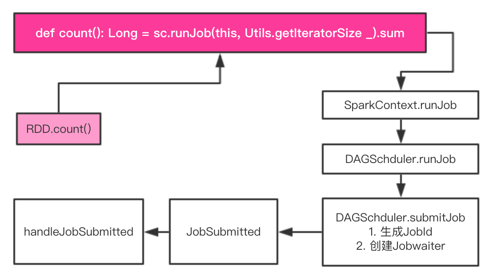

# Spark DAGScheduler 源码解析
# 问题描述
对与Spark执行原理有一定了解的同学对于DAG图(有向无环图，Directed Acyclic Graph的缩写)都会有一定的了解,它描述了RDD之间的依赖关系，和RDD的很多特性都有一定联系。而DAG的形成在Spark中对应的就是DAGScheduler。DAGScheduler的主要工作包括：创建Job，划分Stage，提交Stage等。今天主要看一看关于DAGScheduler的源码。

# 源码追踪
# 1.DAGScheduler生成Stage
这部分包括DAGSCheduler主要工作:创建Job，划分Stage，提交Stage.  
## 1.1从runJob方法开始
查看DAGScheduler源码第一步，首先要找到它 :)  
我们知道Spark都是lazy执行的，只有当RDD进行action操作的时候才会触发执行任务。所以我们从RDD的某个Action操作进入，比如：
```scala
    val someRDD = spark.sparkContext.textFile("xxx/xx.csv").
    someRDD.count()
```
从count算子进入可以找到runJob方法，在这个方法里就可以找到DAGSCheduler了。  
>注释翻译:  在RDD中的给定分区集上运行函数，并将结果返回;
处理函数。这是Spark中所有操作的主要入口点。
```scala
package org.apache.spark

  /**
   * Run a function on a given set of partitions in an RDD and pass the results to the given
   * handler function. This is the main entry point for all actions in Spark.
   */
  def runJob[T, U: ClassTag](
      rdd: RDD[T],
      func: (TaskContext, Iterator[T]) => U,
      partitions: Seq[Int],
      resultHandler: (Int, U) => Unit): Unit = {
    if (stopped.get()) {
      throw new IllegalStateException("SparkContext has been shutdown")
    }
    val callSite = getCallSite
    val cleanedFunc = clean(func)
    logInfo("Starting job: " + callSite.shortForm)
    if (conf.getBoolean("spark.logLineage", false)) {
      logInfo("RDD's recursive dependencies:\n" + rdd.toDebugString)
    }
    //DAGScheduler在这个地方，调用DAGSchduler的runJob方法
    dagScheduler.runJob(rdd, cleanedFunc, partitions, callSite, resultHandler, localProperties.get)
    progressBar.foreach(_.finishAll())
    rdd.doCheckpoint()
  }
```
在这个sparkContext的runJob方法里我们找到了DAGScheduler，而这个方法调用到也是DAGScheduler的runJob方法。在这个runJob里会去调用submitJob提交Job，同时得到一个返回结果waiter，从waiter中看到Job是success还是failure。当然这个submitJob方法也是DAGScheduler的  
>注释翻译：在给定的RDD上运行一个动作作业，并将所有结果传递给resultHandler函数
```scala

  /**
   * Run an action job on the given RDD and pass all the results to the resultHandler function as
   * they arrive.
   */
  def runJob[T, U](
      rdd: RDD[T],
      func: (TaskContext, Iterator[T]) => U,
      partitions: Seq[Int],
      callSite: CallSite,
      resultHandler: (Int, U) => Unit,
      properties: Properties): Unit = {
    val start = System.nanoTime
    //调用submitJob方法并返回Job执行结果
    val waiter = submitJob(rdd, func, partitions, callSite, resultHandler, properties)
    val awaitPermission = null.asInstanceOf[scala.concurrent.CanAwait]
    waiter.completionFuture.ready(Duration.Inf)(awaitPermission)
    waiter.completionFuture.value.get match {
       //Job执行成果
      case scala.util.Success(_) =>
        logInfo("Job %d finished: %s, took %f s".format
          (waiter.jobId, callSite.shortForm, (System.nanoTime - start) / 1e9))
       //Job执行失败
      case scala.util.Failure(exception) =>
        logInfo("Job %d failed: %s, took %f s".format
          (waiter.jobId, callSite.shortForm, (System.nanoTime - start) / 1e9))
        val callerStackTrace = Thread.currentThread().getStackTrace.tail
        exception.setStackTrace(exception.getStackTrace ++ callerStackTrace)
        throw exception
    }
  }
```
在submitJob函数中，比较关键的一点是触发了Scheduler类的一个私有内部类DAGSchedulerEventProcessLoop的JobSubmitted。scala这种写法还是比较有意思的，我不太清楚应该怎么称呼，暂且叫内部私有类
>private[scheduler] class DAGSchedulerEventProcessLoop(dagScheduler: DAGScheduler)
```scala
 def submitJob[T, U](...): JobWaiter[U] = {
    //一些准备处理
    ...
    //job执行结果类
    val waiter = new JobWaiter(this, jobId, partitions.size, resultHandler)
    //这地方触发了Scheduler类的一个私有内部类DAGSchedulerEventProcessLoop的JobSubmitted
    eventProcessLoop.post(JobSubmitted(
      jobId, rdd, func2, partitions.toArray, callSite, waiter,
      SerializationUtils.clone(properties)))
    waiter
  }
```
对于这个类，注释描述它的OnReceive方法是
DAG调度程序的主事件循环。  
在这里，随后调用的就是dagScheduler.handleJobSubmitted了
```scala
private[scheduler] class DAGSchedulerEventProcessLoop(dagScheduler: DAGScheduler)
  extends EventLoop[DAGSchedulerEvent]("dag-scheduler-event-loop") with Logging {

  private[this] val timer = dagScheduler.metricsSource.messageProcessingTimer

  /**
   * The main event loop of the DAG scheduler.
   */
  override def onReceive(event: DAGSchedulerEvent): Unit = {
    val timerContext = timer.time()
    try {
      doOnReceive(event)
    } finally {
      timerContext.stop()
    }
  }

  private def doOnReceive(event: DAGSchedulerEvent): Unit = event match {
    //代码走到这里调用的case:JobSubmitted
    case JobSubmitted(jobId, rdd, func, partitions, callSite, listener, properties) =>
      dagScheduler.handleJobSubmitted(jobId, rdd, func, partitions, callSite, listener, properties)
    //还有很多种case
    ...
    }
  override def onError(e: Throwable): Unit = {...}
  override def onStop(): Unit = {...}
```




## 1.2 从Stage到Task
触发action算子的一般都是Final RDD，它只会有父RDD而不会有子RDD(在这个Job中)。它所在的stage也一定是Final Stage，但是这个Final Stage能否执行，取决于它的依赖Stage。
```scala
private[scheduler] def handleJobSubmitted(jobId: Int,
      finalRDD: RDD[_],
      func: (TaskContext, Iterator[_]) => _,
      partitions: Array[Int],
      callSite: CallSite,
      listener: JobListener,
      properties: Properties) {
    var finalStage: ResultStage = null
    try {
      // New stage creation may throw an exception if, for example, jobs are run on a
      // HadoopRDD whose underlying HDFS files have been deleted.
      finalStage = createResultStage(finalRDD, func, partitions, jobId, callSite)
    } catch {
      case e: Exception =>
        logWarning("Creating new stage failed due to exception - job: " + jobId, e)
        listener.jobFailed(e)
        return
    }

    val job = new ActiveJob(jobId, finalStage, callSite, listener, properties)
    clearCacheLocs()
    logInfo("Got job %s (%s) with %d output partitions".format(
      job.jobId, callSite.shortForm, partitions.length))
    logInfo("Final stage: " + finalStage + " (" + finalStage.name + ")")
    logInfo("Parents of final stage: " + finalStage.parents)
    logInfo("Missing parents: " + getMissingParentStages(finalStage))

    val jobSubmissionTime = clock.getTimeMillis()
    jobIdToActiveJob(jobId) = job
    activeJobs += job
    finalStage.setActiveJob(job)
    val stageIds = jobIdToStageIds(jobId).toArray
    val stageInfos = stageIds.flatMap(id => stageIdToStage.get(id).map(_.latestInfo))
    listenerBus.post(
      SparkListenerJobStart(job.jobId, jobSubmissionTime, stageInfos, properties))
    submitStage(finalStage)
  }

```
关于上面这个方法我没有看太明白，都贴了出来，至于明白的部分，感觉比较关键的是以下三个步骤
>//创建一个finalStage     
>finalStage = createResultStage(finalRDD, func, partitions, jobId, callSite)  
>//实例化一个activeJob  
>val job = new ActiveJob(jobId, finalStage, callSite, listener, properties)  
>//执行submitStage方法  
>submitStage(finalStage)

最后这个方法提交finalStage，但是finalStage肯定不会首先执行，它要先执行它的依赖stage。这里有个比较迷惑人的一点是这个missing parents，据推测应该就是宽依赖的意思，也就是missing parents RDD就是宽依赖RDD。这也和之前了解到的宽依赖划分stage相同。
>注释翻译:提交阶段，但首先递归提交任何宽依赖（ any missing parents）。
```scala
  /** Submits stage, but first recursively submits any missing parents. */
  private def submitStage(stage: Stage) {
    val jobId = activeJobForStage(stage)
    if (jobId.isDefined) {
      logDebug("submitStage(" + stage + ")")
      if (!waitingStages(stage) && !runningStages(stage) && !failedStages(stage)) {
      //调用getMissingParentStages返回List[Stage]按id排序
        val missing = getMissingParentStages(stage).sortBy(_.id)
        logDebug("missing: " + missing)
        if (missing.isEmpty) {
          logInfo("Submitting " + stage + " (" + stage.rdd + "), which has no missing parents")
          submitMissingTasks(stage, jobId.get)
        } else {
          for (parent <- missing) {
          //通过stage id由小到大 递归执行
            submitStage(parent)
          }
          waitingStages += stage
        }
      }
    } else {
      abortStage(stage, "No active job for stage " + stage.id, None)
    }
  }

```
上面方法中调用的getMissingParentStages(stage)就是划分stage的方法啦！这个方法用一个栈来实现递归的切分stage,然后返回一个宽依赖的HashSet，如果是宽依赖类型就会调用。这个方法感觉挺重要的也不知道为什么连个注释都没有。还有在handleJobSubmitted方法中调用submitStage之前，在loginfo里也调用了getMissingParentStages方法 看不懂到底想在哪划分的，所以说handleJobSubmitted没太看明白。  
好的，我们找到了Stage怎么划分的，再看Stage执行，在提交Stage方法中有递归方法(递归划分依赖Stage)，递归方法的跳槽是list为空 然后执行submitMissingTasks。也就是对于没有依赖的Stage，可以执行：
>submitMissingTasks(stage, jobId.get)

这个方法很长，但是可以很容易的看出是从Stage到执行Task了
>注释翻译:当Stage的父母可以使用时，我们可以执行它的Task
```scala

  /** Called when stage's parents are available and we can now do its task. */
  private def submitMissingTasks(stage: Stage, jobId: Int) {
    ...
    val tasks: Seq[Task[_]] = try {
      stage match {
        case stage: ShuffleMapStage =>...}

        case stage: ResultStage =>...}
      }
    }
    ...
    if (tasks.size > 0) {
        ...
        //这个地方调用了TaskScheduler
      taskScheduler.submitTasks(new TaskSet(
        tasks.toArray, stage.id, stage.latestInfo.attemptId, jobId, properties))
      stage.latestInfo.submissionTime = Some(clock.getTimeMillis())
    }
    ...
      submitWaitingChildStages(stage)
    }
```

# 2.DAGScheduler其他点
我们从rdd的action操作开始看起的，但是其实并没有看到DAGSCheduler的初始化，而它也不是在action操作时初始化的，回顾以下spark架构，突然想起来，sparkContext初始化的时候做的五件事其中就有初始化DAGSCheduler,代码如下:
```scala
package org.apache.spark
class SparkContext(config: SparkConf) extends Logging {
  @volatile private var _dagScheduler: DAGScheduler = _
    ...
    //初始化DAGScheduler
  _dagScheduler = new DAGScheduler(this)
}
```
除此之外，从这个类中可以看出，我们追踪的创建JOB划分Stage提交Stage只是DAGScheduler的一部分功能，TaskScheduler也会回调DAGscheduler，它还负责Executor的丢失，Executor的add，Stage重新计算等等等等。
```scala
private def doOnReceive(event: DAGSchedulerEvent): Unit = event match {
    //上文追踪的代码
    case JobSubmitted(jobId, rdd, func, partitions, callSite, listener, properties) =>
      dagScheduler.handleJobSubmitted(jobId, rdd, func, partitions, callSite, listener, properties)

    case MapStageSubmitted(jobId, dependency, callSite, listener, properties) =>...
    case StageCancelled(stageId) =>...
    case JobCancelled(jobId) =>...
    case JobGroupCancelled(groupId) =>...
    case AllJobsCancelled =>...
    case ExecutorAdded(execId, host) =>...
    case ExecutorLost(execId, reason) =>...
    case BeginEvent(task, taskInfo) =>...
    case GettingResultEvent(taskInfo) =>...
    case completion: CompletionEvent =>...
    case TaskSetFailed(taskSet, reason, exception) =>...
    case ResubmitFailedStages =>...
    
  }
```

# 3.结束
DAGScheduler在Spark的任务调度中扮演了十分重要的角色，这次主要走读了创建Job、划分Stage、提交Stage最后到TaskScheduler的过程。
# 4.参考资料
Spark源码 2.1.1  
《深入理解Spark：核心思想与源码分析》耿嘉安 著  
[Spark核心作业调度和任务调度之DAGScheduler源码](https://www.cnblogs.com/arachis/p/Spark_TaskScheduler_1.html)

